## Screenshots

### **Homepage**

  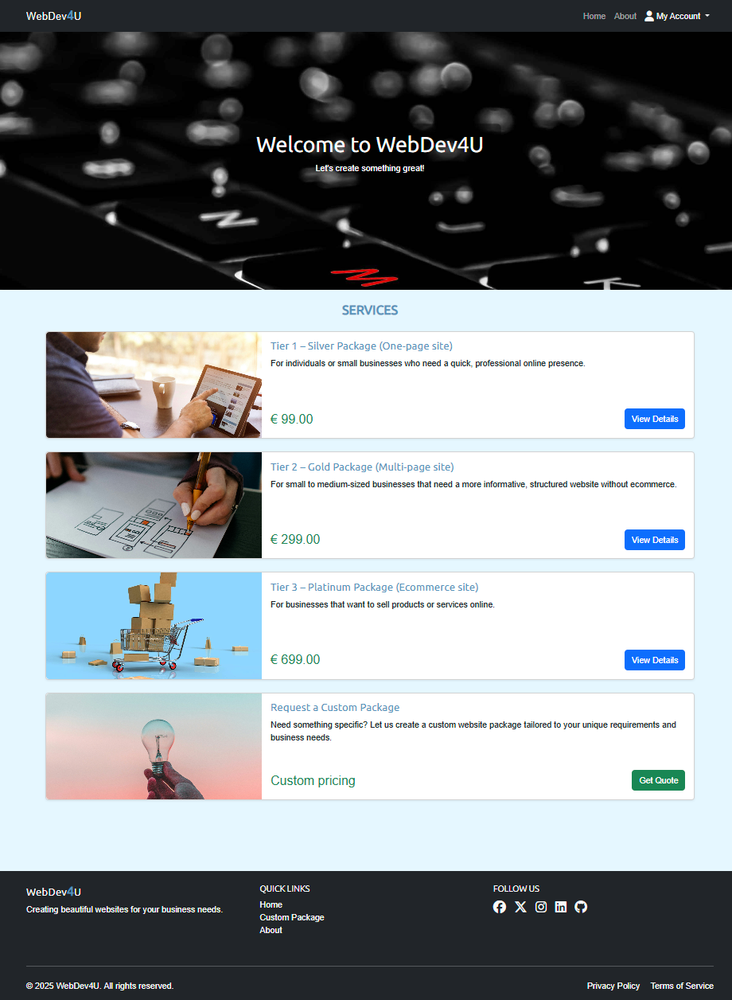

### **Navbar**

  

### **Navbar dropdown logged in** (Product management available only for admin)

  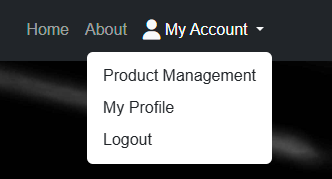

### **Navbar dropdown logged out**

  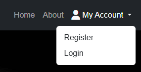

### **Product detail**

  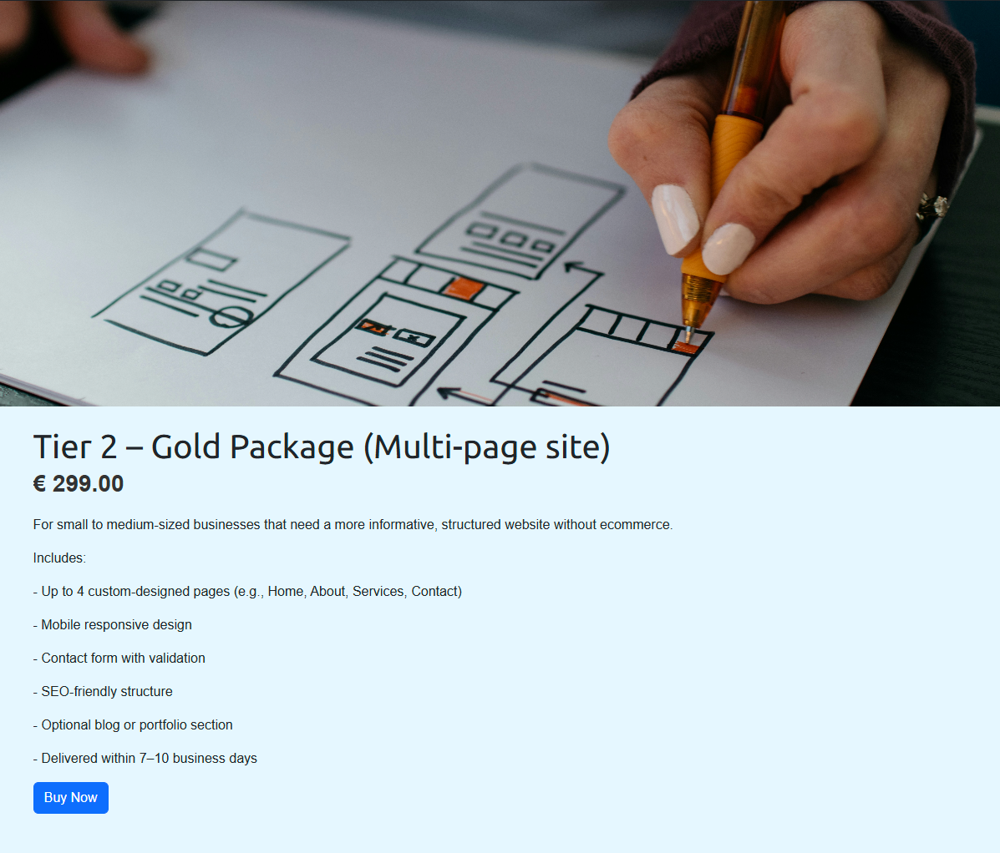

### **User profile**

  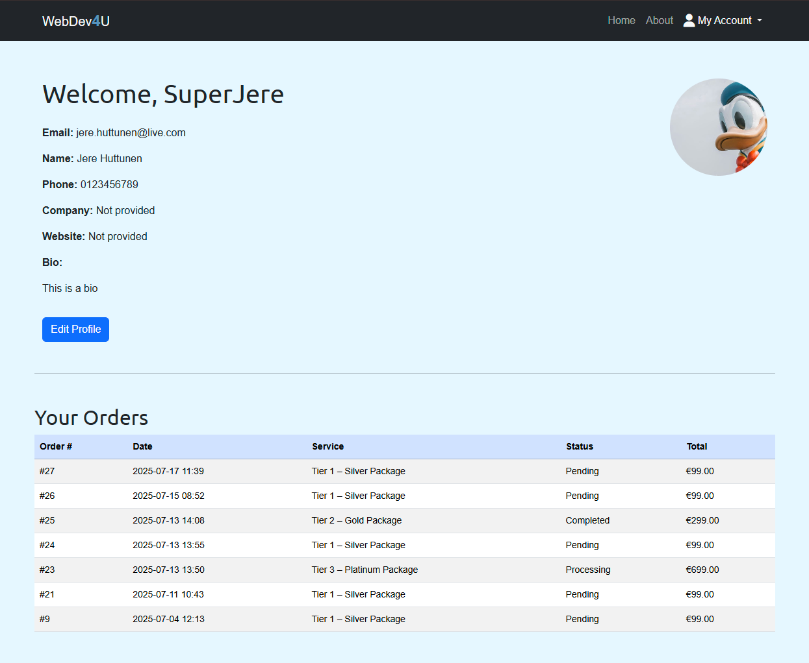

### **About**

  

### **404**

  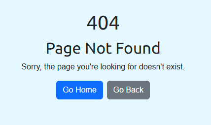

### **Custom request**

  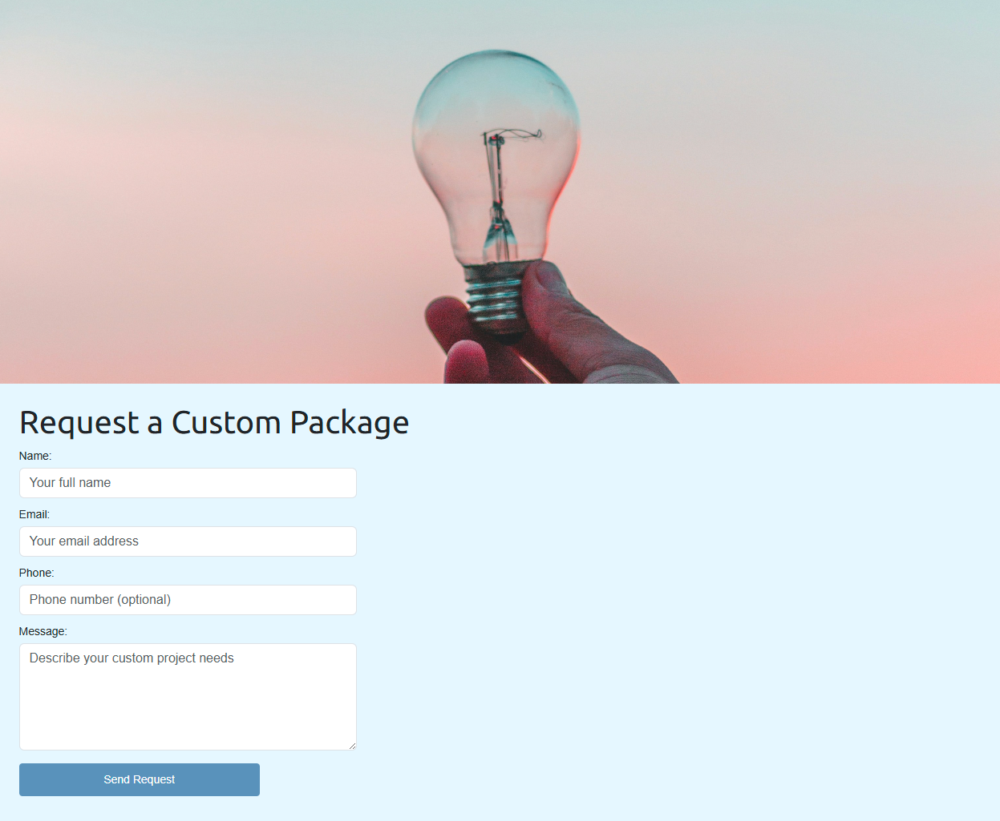

### **Custom request success**

  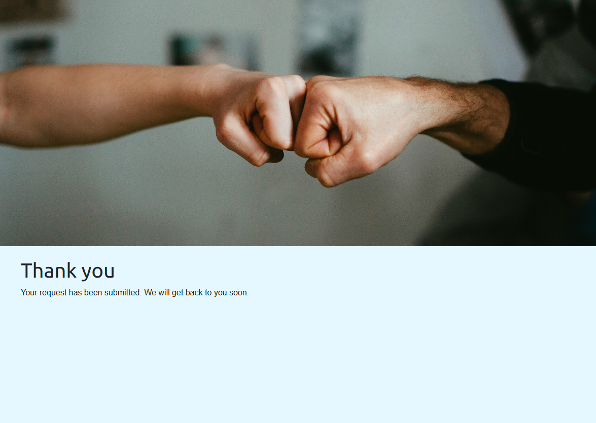

### **Checkout form**

  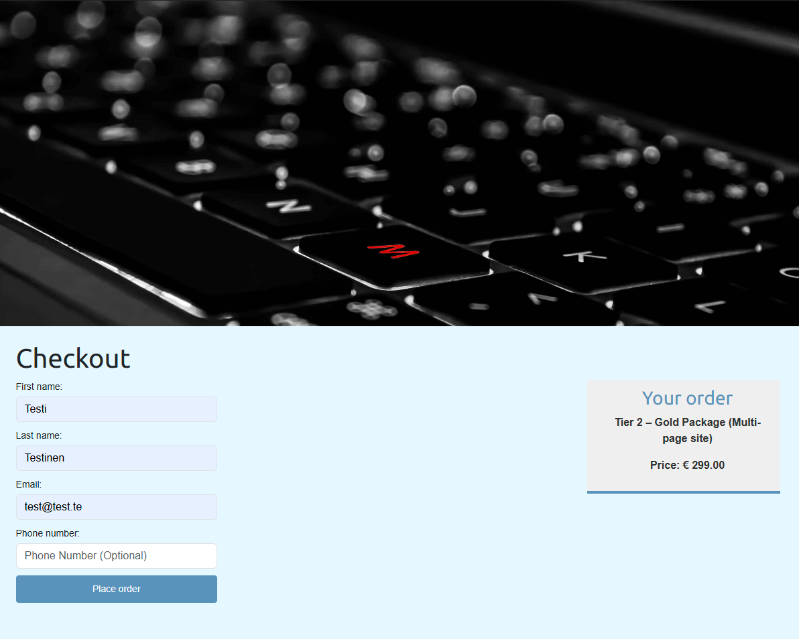

### **Checkout confirmation**

  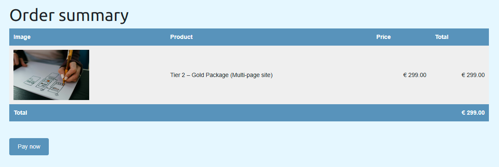

### **Checkout Stripe**

  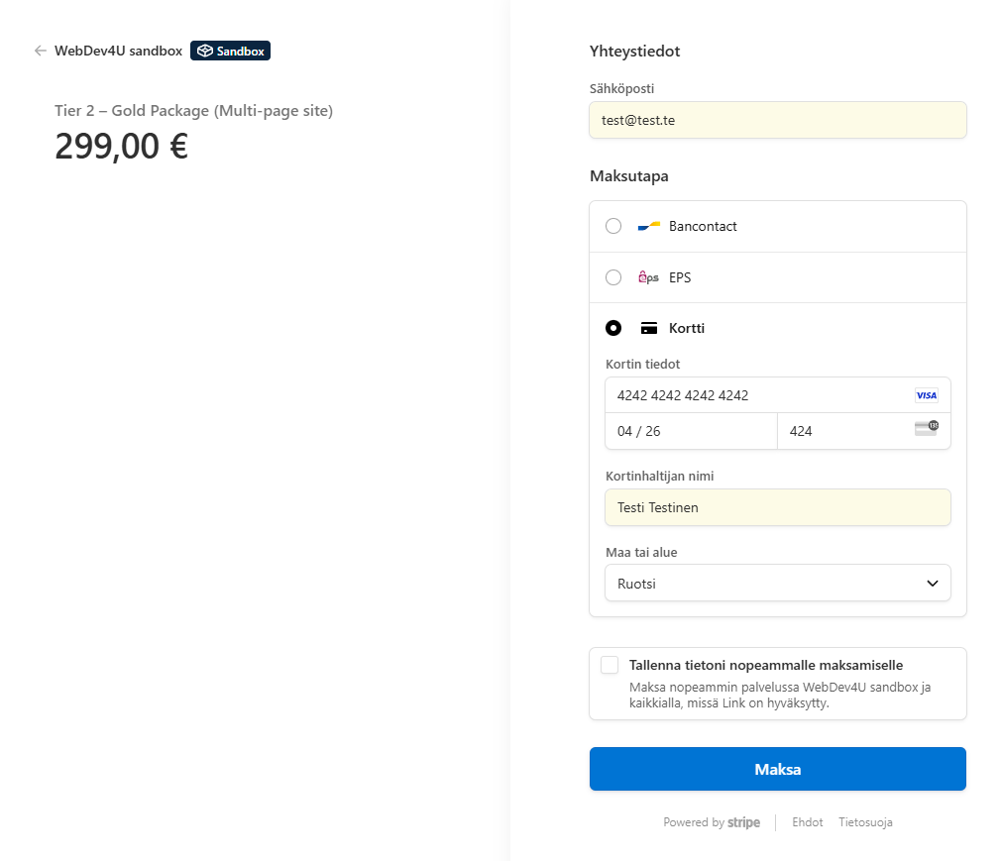

### **Checkout success**

  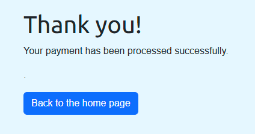

### **Checkout cancelled**

  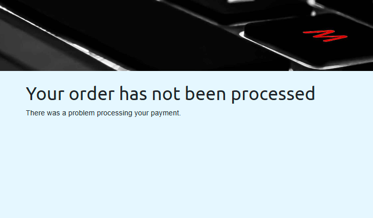

## Django Admin

### **Admin dashboard**

  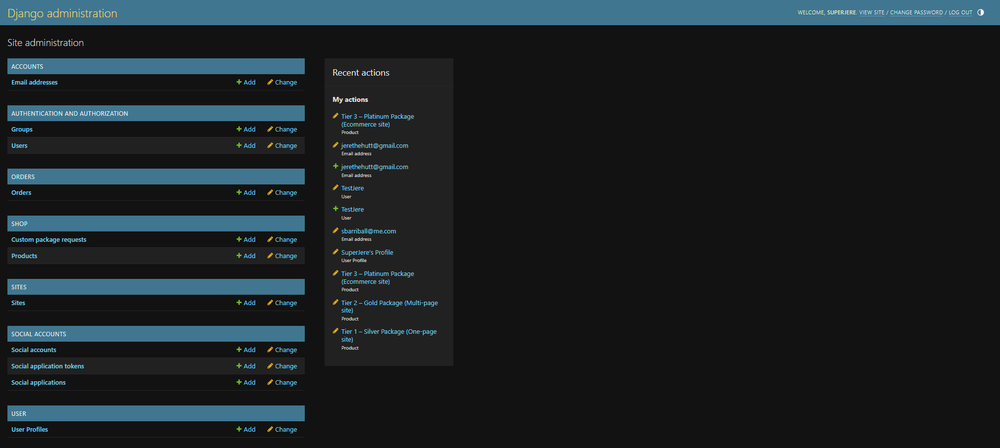

### **Admin orders** (with custom order views and generated pdf files)

  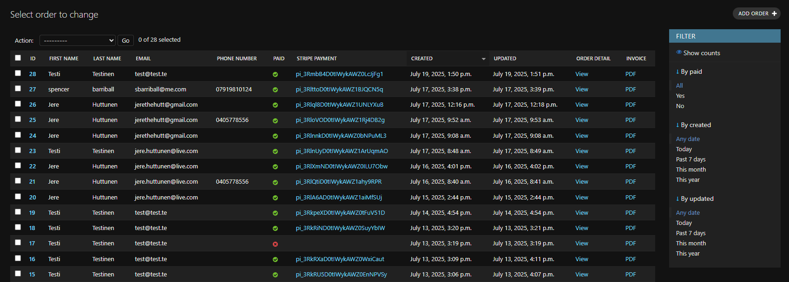

### **Admin custom requests**

  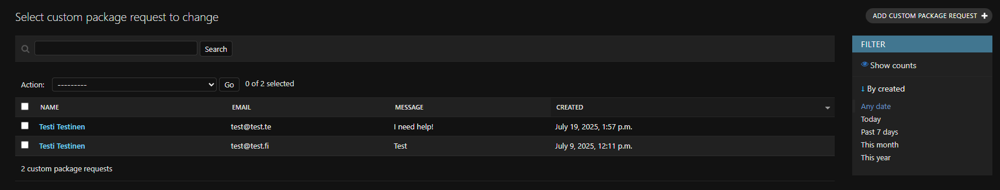

### **Admin products**

  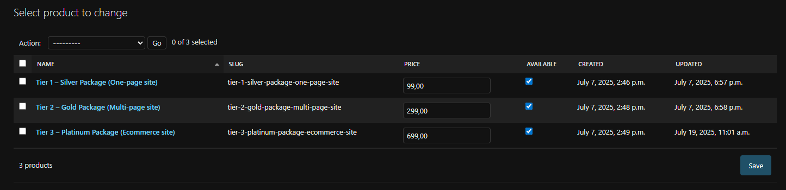
